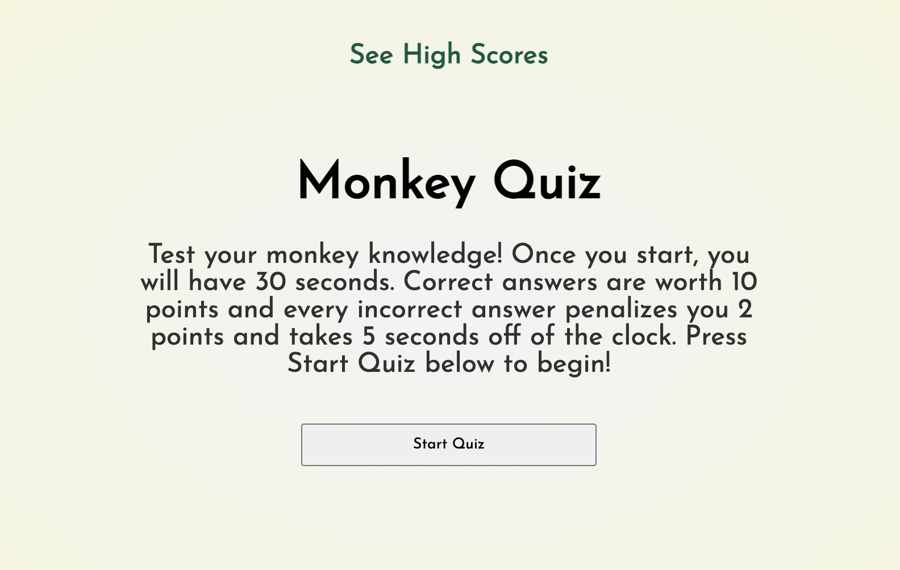
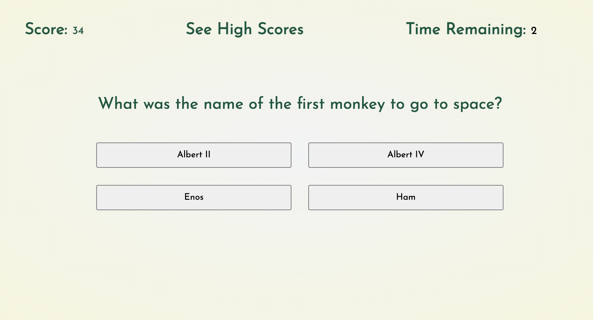
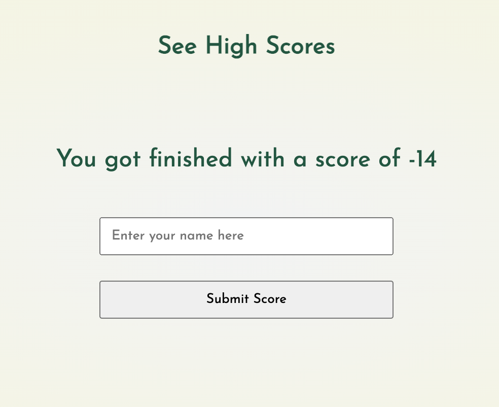
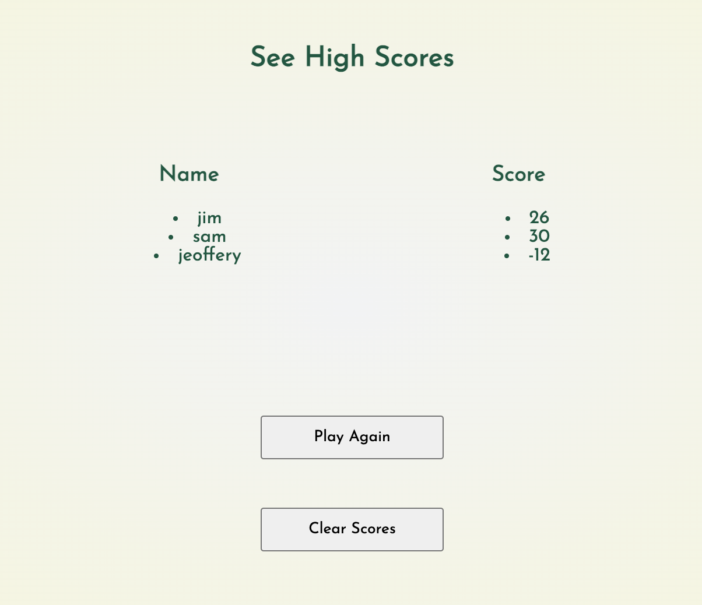
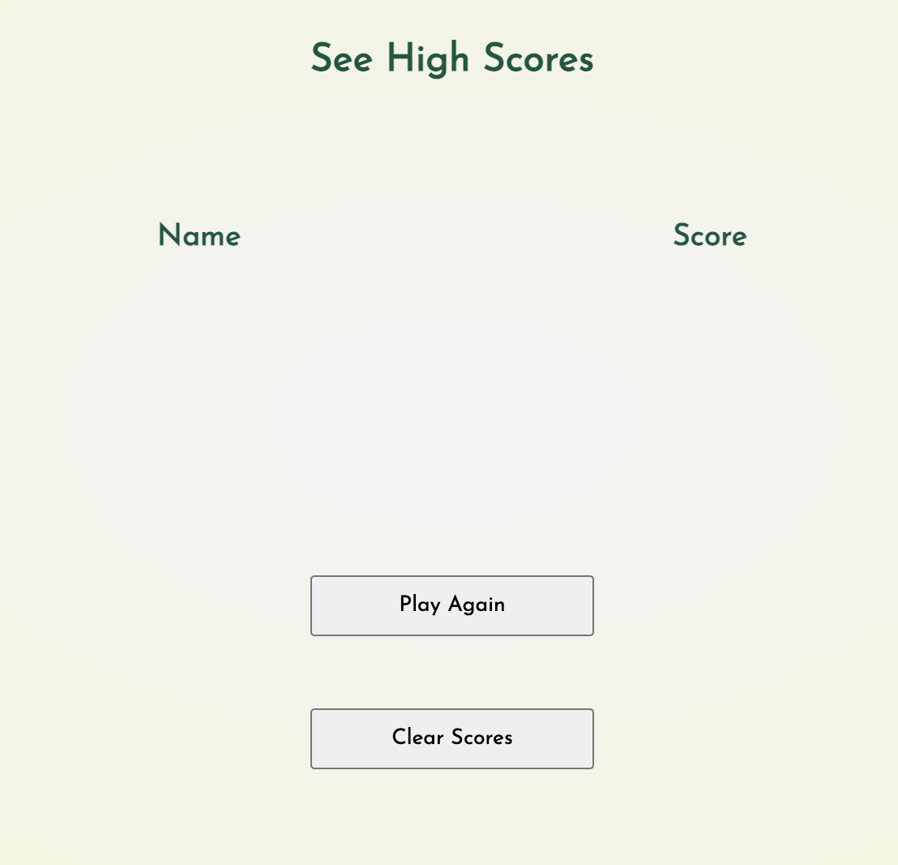

# Module 4 Challenge

# Monkey Quiz

## Description

The goal of this project was to create a timed quiz that stored high scores. When the quiz is started, the user is presented with a question and four options to choose from. With each correct answer the user's score increments by 10 and with every wrong answer the user's score decrements by 2. Further, a 30 second timer begins when the quiz is started, and decrements by 5 seconds with each wrong answer. When there is no more time remaining or questions left, the quiz ends. The user can then submit their score along with their name to the high scores list. This list will be saved until cleared. 

## Installation

N/A

## Usage

Link to view the deployed application: https://noah138.github.io/Quiz-show/

Upon navigating to the webpage, the user is shown the starting screen:

Clicking 'Start Quiz' will present the user with the first of a possible 10 questions to answer. The time remaining is displayed in the top right and the score is displayed in the top left. Clicking on 'See High Scores' will navigate you to the high scores screen.

When time is up or there are no more questions the user is presented with a screen telling them their score and giving them the option to submit their score. To submit a score one must enter something in the 'Enter your name here' box.

After submitting a score the user is taken to the high scores page, which displays a list of past scores and their associated names:

Clicking the 'Clear Scores' button will erase the scores:

Clicking 'Play Again' navigates back to the starting screen.

## Credits

The incredible team of instructors at the UW Full-Time Online Coding Boot 2022

## License

Please refer to the liscense in the repo.